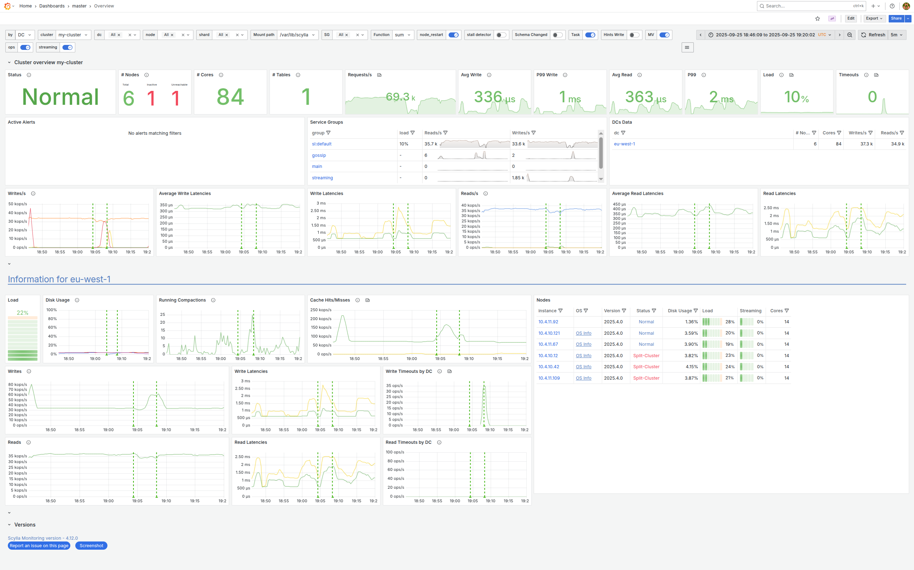

Scylla Monitoring Stack
=======================

.. toctree::
   :maxdepth: 1
   :hidden:

   User Guide <use-monitoring/index>
   Download and Install <install/index>
   Procedures <procedures/index>
   Troubleshooting <troubleshooting/index>
   Reference <reference/index>

.. include:: /_common/monitor-description.rst

The Scylla Monitoring Stack consists of three components, wrapped in Docker containers:

* `prometheus` - collects and stores metrics
* `alertmanager` - handles alerts
* `grafana` - dashboard server

**Choose a topic to get started**:

* :doc:`User Guide <use-monitoring/index>`
* :doc:`Download and Install <install/index>`
* :doc:`Procedures <procedures/index>`
* :doc:`Troubleshooting <troubleshooting/index>`
* :doc:`Reference <reference/index>`
* `Scylla Monitoring Stack lesson <https://university.scylladb.com/courses/scylla-operations/lessons/admin-procedures-and-basic-monitoring/>`_ on Scylla University

For older versions of Scylla Monitoring Stack Documentation see `here <https://docs.scylladb.com/operating-scylla/monitoring/>`_.
