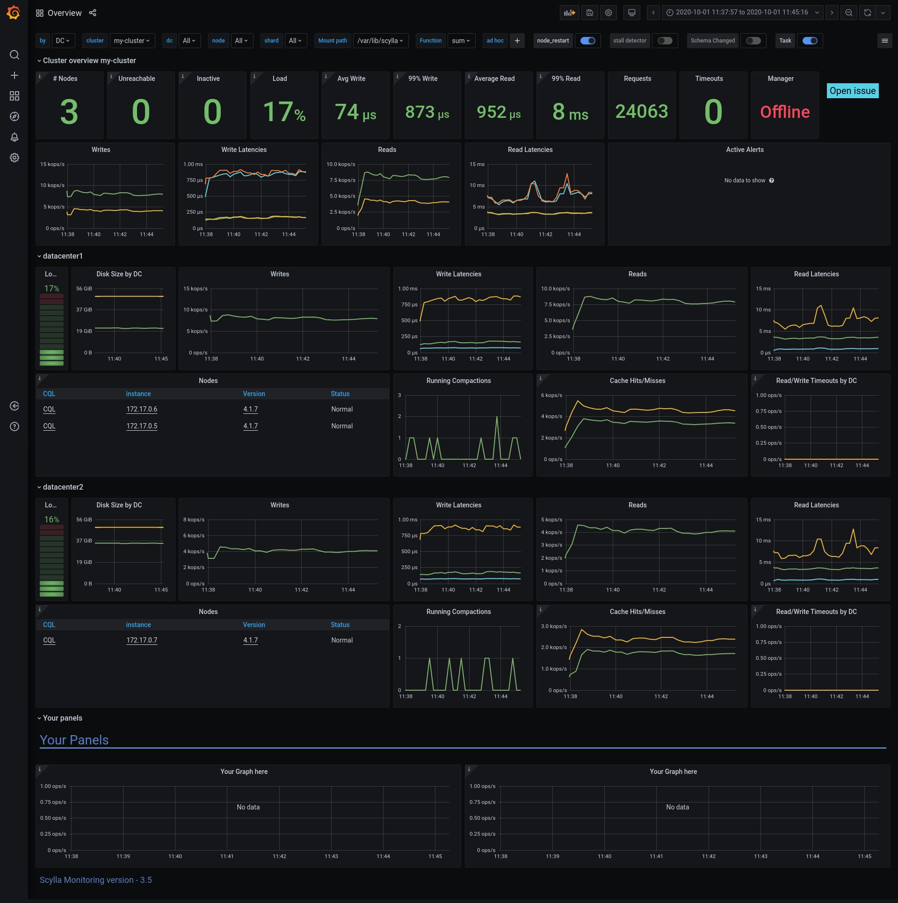

==========================
ScyllaDB Monitoring Stack
==========================

.. include:: /common/monitor-description.rst

The ScyllaDB Monitoring Stack consists of multiple components, wrapped in Docker containers:

* `prometheus` - Collects and stores metrics
* `grafan-loki` - Parses logs and generates metrics and alerts 
* `alertmanager` - Handles alerts
* `grafana` - Dashboards server

A few optional components are used for additional services

* `grafana-image-renderer` - Allows you to download a dashboard as an image.
* `Thanos sidecar` - Allows a centralized Thanos server to read from the local Prometheus server.

High Level Architecture
----------------------- 

.. image:: monitoring_stack.png
    :width: 400pt

We use Prometheus for metrics collection and storage, and to generate alerts. Prometheus collects Scylla’s metrics from ScyllaDB and the
host metrics from the `node_exporter` agent that runs on the ScyllaDB server.

We use Loki for metrics and alerts generation based on logs, Loki gets the logs from rsyslog agents that run on each of the DB servers.

The alertmanager, receives alerts from Prometheus and Loki and distributes them to other systems like email and slack.

We use Grafana to display the dashboards. Grafana gets its data from Prometheus, the alertmanager and directly from ScyllaDB using CQL.
   

**Choose a topic to get started**:

* :doc:`User Guide <use-monitoring/index>`
* :doc:`Download and Install <install/index>`
* :doc:`Procedures <procedures/index>`
* :doc:`Troubleshooting <troubleshooting/index>`
* :doc:`Reference <reference/index>`
* `ScyllaDB Monitoring Stack lesson <https://university.scylladb.com/courses/scylla-operations/lessons/scylla-monitoring/>`_ on ScyllaDB University

